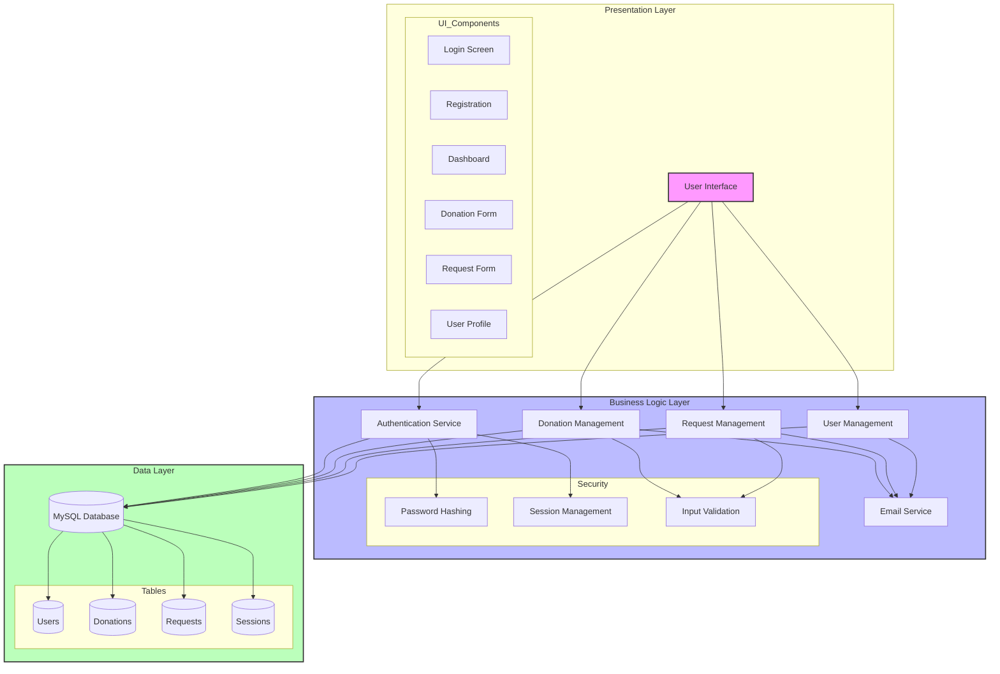

# CrowdNest System Architecture

## Layer Descriptions

### Presentation Layer
- Modern Tkinter-based GUI
- Responsive user interface components
- Intuitive navigation and forms
- Real-time status updates

### Business Logic Layer
- Authentication with SHA-256 hashing
- Session management and security
- Donation and request processing
- Email notifications via SMTP
- Input validation and sanitization

### Data Layer
- MySQL database for persistent storage
- Optimized table structures
- Secure data access
- Efficient query handling

## Key Features
- Secure user authentication
- Resource donation management
- Request processing system
- Email notifications
- Profile management
- History tracking