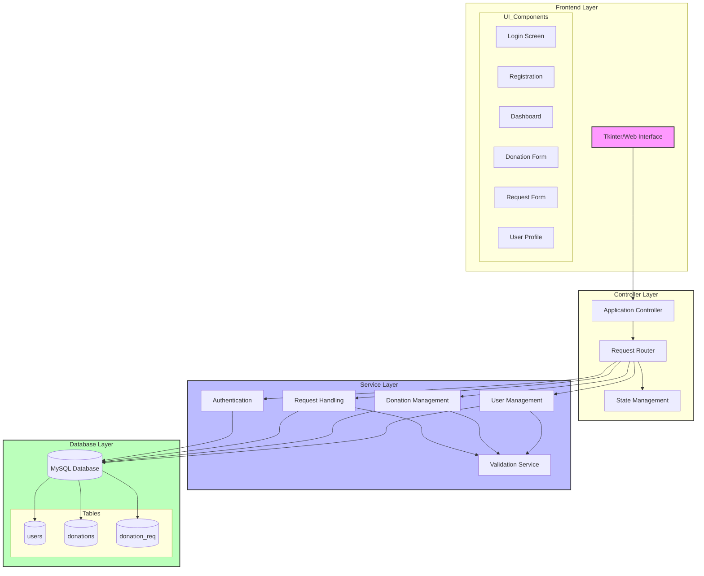

# CrowdNest System Architecture

## System Block Diagram (Text Version)

```
+-------------------+
|    Frontend UI    |
|   (Tkinter)   |
+--------+----------+
         |
         v
+--------+----------+
|   Application     |
|    Controller     |
+--------+----------+
         |
         v
+--------+----------+
|   Service Layer   |
| - User Management |
| - Donation Mgmt   |
| - Request Handling|
+--------+----------+
         |
         v
+--------+----------+
|  Database Layer   |
| - MySQL Database  |
| - Tables:         |
|   * users         |
|   * donations     |
|   * donation_req  |
+-------------------+
```



## Layer Descriptions

### Frontend Layer (Tkinter/Web)
- Modern Tkinter-based GUI interface
- Responsive and intuitive user components
- Form handling and validation
- Real-time status updates
- Event handling and user interactions

### Application Controller Layer
- Central request routing and handling
- State management and data flow control
- Component coordination
- Error handling and logging
- Session management

### Service Layer
- User Management Service
  * User registration and authentication
  * Profile management
  * Access control
- Donation Management Service
  * Donation processing
  * Resource allocation
  * Status tracking
- Request Handling Service
  * Request validation
  * Request processing
  * Notification handling

### Database Layer
- MySQL database for persistent storage
- Core tables:
  * users: User information and credentials
  * donations: Donation records and status
  * donation_req: Request tracking and management
- Optimized query handling
- Data integrity and security

## Key Features
- Clean separation of concerns across layers
- Centralized request handling through controller
- Modular service architecture
- Secure data management
- Scalable component structure